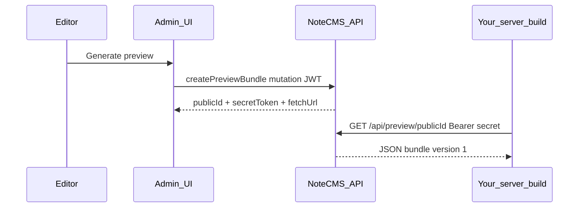

# Preview bundles — pre-publish content on your site

This guide explains how **frozen preview bundles** work in NoteCMS and how to wire them into a real frontend or static build.

## What it is

- Editors mint a **snapshot** of the workspace from **Site settings → Builds** (“Preview unpublished content”). The API stores that snapshot once; repeated GETs return the **same JSON** until expiry or revoke.
- Consumption is via **`GET /api/preview/:publicId`** with **`Authorization: Bearer <secret>`**. The secret is shown **only once** at creation time.
- The JSON shape is **site export bundle `version: 1`** — the same as GraphQL **`exportSiteBundle`** / **workspace JSON export**, **not** the assembled `BuildSnapshot` object from **`fetchBuildSnapshot`** in `@notecms/sdk`. If your pipeline already imports workspace exports, you can reuse that importer for previews.

## End-to-end flow

1. **CMS:** Editor chooses TTL (and optional label) → **Generate preview bundle**.
2. **CMS:** Copy **`GET` URL** (or path) and **Bearer secret** immediately; the secret is not stored in the UI.
3. **Your site / CI:** Set server-only env vars (see below) and fetch the bundle at build time or in SSR.
4. **Your code:** Parse `bundle.version === 1` and map `contentTypes`, `entries`, `siteSettings`, `assets` into your pages (same as handling an exported `.json` file).



## API behaviour

| Piece | Detail |
| --- | --- |
| **Mint** | GraphQL `createPreviewBundle(siteId, ttlMinutes, label)` — **JWT session only** (editors+). API keys cannot mint previews. |
| **List / revoke** | `listPreviewBundles`, `revokePreviewBundle` — same auth as mint. |
| **Fetch** | `GET {PUBLIC_API_BASE_URL}/api/preview/:publicId` with header `Authorization: Bearer <secret>`. Optional query `?token=` is supported but **avoid** (referrer leakage). |
| **Response headers** | `Content-Type: application/json`, `Cache-Control: private, no-store`, `X-Content-SHA256` (matches stored payload). |

### Environment variables (API host)

| Variable | Purpose |
| --- | --- |
| **`PUBLIC_API_BASE_URL`** | Public origin of the API **without** trailing slash (e.g. `https://api.example.com`). Needed so the admin UI can show a full preview URL when minting. |
| `PREVIEW_BUNDLE_RATE_LIMIT_MAX` | Max GET requests per IP per window for `/api/preview/*` (default `120`). |
| `PREVIEW_BUNDLE_RATE_LIMIT_WINDOW_MS` | Rate-limit window in ms (default `900_000`). |
| `MAX_ACTIVE_PREVIEW_BUNDLES_PER_SITE` | Active (non-revoked, non-expired) previews per workspace (default `10`). |
| `PREVIEW_BUNDLE_MAX_TTL_MINUTES` | Upper cap on TTL editors can choose (default `10080` = 7 days). |
| `PREVIEW_BUNDLE_INLINE_MAX_BYTES` | Payloads larger than this are stored in MongoDB **GridFS** (`previewBundles` bucket); smaller payloads are inline (default ~12 MiB). |

### Publish watermark (optional, separate from preview)

On **`POST /hooks/site-build/:siteId`** with **`status: success`**, the API may persist **`SiteSettings.lastPublishedWatermark`** from the JSON **`detail`** field:

- `contentRevision` (number) — aligns with **`SiteSettings.contentRevision`**, which increments when entries, types, settings, or assets change.
- `bundleHash` (string)
- `builtAt` (string, e.g. ISO timestamp)
- `workflowRunId` (string)

Example completion POST body:

```json
{
  "status": "success",
  "runUrl": "https://github.com/org/repo/actions/runs/123",
  "detail": {
    "contentRevision": 42,
    "bundleHash": "sha256:…",
    "builtAt": "2026-04-23T12:00:00Z",
    "workflowRunId": "12345678901"
  }
}
```

Your static pipeline can echo **`contentRevision`** from the CMS (e.g. read via GraphQL during build) so the callback records what was actually deployed.

## Implementing on your site

### Security (non-negotiable)

- Treat the preview **secret like a password**: **server-only** env, never `NEXT_PUBLIC_*`, `VITE_*`, or client bundles.
- Preview URLs grant **read-equivalent access** to full workspace export data. Use **short TTLs** and **revoke** when done.
- Prefer **Bearer** header over `?token=` on GET.

### Suggested env vars (consumer)

| Variable | Example |
| --- | --- |
| `NOTECMS_API_BASE_URL` | `https://api.example.com` — API origin **without** `/graphql`. |
| `NOTECMS_PREVIEW_PUBLIC_ID` | UUID from the admin UI after minting. |
| `NOTECMS_PREVIEW_SECRET` | Bearer secret shown once at mint. |

### Entry editor: “Open live site (preview)”

For content types with **public slug** (`hasSlug`), the entry edit screen includes **Open live site (preview)** (owners/editors only).

1. **Save** the entry — the frozen bundle always reflects **persisted** CMS data, not unsaved form state.
2. The workspace **Site URL** (Site settings — same value shown next to the slug field) must be correct; paths are built as **`{Site.url}/{entry.slug}`**, matching the admin slug hint (`https://…/your-slug`). If your production router uses a prefix (e.g. `/blog/:slug`), add redirects or adjust how you map slugs until optional CMS-side path templates exist.

Clicking the button:

1. Calls **`createPreviewBundle`** with a **4-hour** TTL and opens a **new tab** to:

   `{yourLiveSite}/{slug}?notecms_preview_id=<uuid>&notecms_preview_token=<secret>`

2. Query parameter names are fixed (also exported from **`@notecms/sdk`** as **`NOTECMS_PREVIEW_QUERY_ID`** and **`NOTECMS_PREVIEW_QUERY_TOKEN`**; use **`parseNoteCmsPreviewQueryFromSearchParams`** / **`buildUrlWithNoteCmsPreviewParams`**):

   - **`notecms_preview_id`** — preview bundle public id (same as in `GET /api/preview/:publicId`).
   - **`notecms_preview_token`** — bearer secret for that bundle.

**Your frontend must handle this explicitly.** Typical SSR middleware:

1. If both params exist on the request URL, read them server-side (never expose the token to client-side bundles).
2. Call **`fetchPreviewBundle(apiBaseUrl, notecms_preview_id, { token: notecms_preview_token })`** (or plain `fetch` with `Authorization: Bearer`).
3. Put the bundle in request context / cache for that render.
4. **Redirect** (`302`/`303`) to the **same path without** those query params, or use **`history.replaceState`** after first paint, so the secret does not stay in the address bar or leak via **`Referer`** on outbound links.

Because the secret appears once in the initial URL, use **HTTPS**, restrict who can use the CMS, and treat links like passwords.

Branch previews in build logic:

```ts
// Pseudocode — run only on server / CI
if (process.env.NOTECMS_PREVIEW_PUBLIC_ID && process.env.NOTECMS_PREVIEW_SECRET) {
  const { bundle } = await fetchPreviewBundle(
    process.env.NOTECMS_API_BASE_URL!,
    process.env.NOTECMS_PREVIEW_PUBLIC_ID,
    { token: process.env.NOTECMS_PREVIEW_SECRET },
  );
  // bundle.version === 1 — feed your export-bundle importer
} else {
  const snapshot = await fetchBuildSnapshot(cms, { includeAssets: true });
  // existing production path
}
```

Use **`fetchPreviewBundle`** / **`fetchPreviewSiteBundle`** from **`@notecms/sdk`** (see package README).

### Shape reference (`version: 1`)

Top-level fields typically include:

- `version`, `exportedAt`, `siteId`
- `contentTypes` — array of types with `legacyId`, `slug`, `fields`, `options`
- `entries` — array of groups keyed by content type slug with `items[]` (`name`, `slug`, `data`)
- `siteSettings` — portable menus + branding export ids
- `assets` — optional embedded asset payloads for export portability

Exact serialization lives in **`exportSiteBundleService`** in the API repo (`apps/api/src/site/site-bundle-service.ts`). TypeScript type **`SiteExportBundleV1`** in **`@notecms/sdk`** is a loose structural helper.

### Consistency

Frozen at mint time = **best-effort** relative to concurrent edits (same class of caveat as paginated snapshots). For reproducible QA, avoid editing the workspace while someone verifies a specific preview id.

## Related docs

- [README.md](../README.md) — deploy webhooks and `PUBLIC_API_BASE_URL`
- [packages/notecms-sdk/README.md](../packages/notecms-sdk/README.md) — `fetchPreviewBundle`, production snapshot patterns
- [apps/api/docs/mcp-and-scoped-keys.md](../apps/api/docs/mcp-and-scoped-keys.md) — API keys (preview mint is **not** exposed via MCP)
